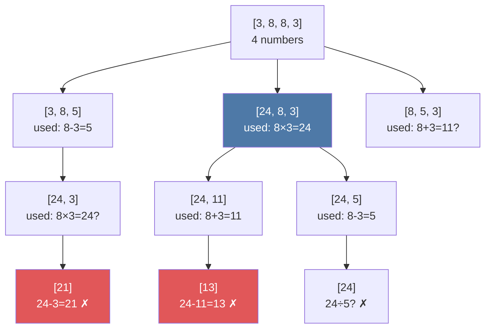
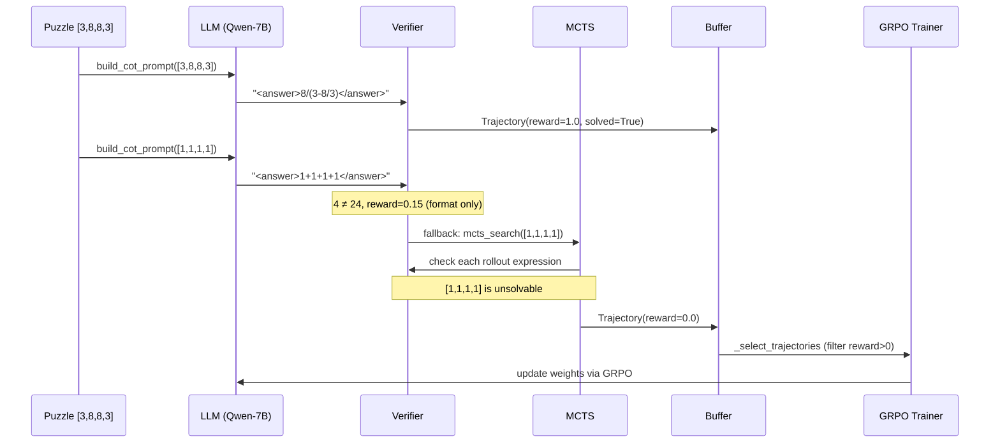

# Part 1: System Architecture

← [Part 0: The Game](00-what-is-game-of-24.md) | Next: [Part 2: The Verifier →](02-verifier.md)

---

## The Big Picture

The system has three co-operating layers that share a single deterministic reward signal.

```
┌─────────────────────────────────────────────────────────────────────┐
│                        ONLINE LOOP (GPU)                            │
│                                                                     │
│   ┌──────────┐    prompt     ┌─────────────┐    response           │
│   │  Puzzle  │ ────────────► │  LLM + CoT  │ ──────────────┐       │
│   │ [3,8,8,3]│               │  (Qwen-7B)  │              │       │
│   └──────────┘               └─────────────┘              ▼       │
│                                                    ┌──────────────┐ │
│                                                    │  Verifier    │ │
│                                                    │ (AST-based)  │ │
│                                                    └──────┬───────┘ │
│                                  ┌──────────────┐        │         │
│                                  │     MCTS     │◄───────┘ failed  │
│                                  │ (fallback)   │        │         │
│                                  └──────┬───────┘        │ reward  │
│                                         │                │         │
│                         ┌───────────────▼────────────────▼───────┐ │
│                         │         Trajectory Buffer               │ │
│                         │   (puzzle, prompt, response, reward)    │ │
│                         └───────────────────┬─────────────────────┘ │
│                                             │                       │
│                                     ┌───────▼──────┐               │
│                                     │     GRPO     │               │
│                                     │   Trainer    │               │
│                                     └───────┬──────┘               │
│                                             │ improved policy       │
│                                             ▼                       │
│                                     updated LLM weights ───────────┐│
└─────────────────────────────────────────────────────────────────────┘
```

---

## Layer-by-Layer Breakdown

### Layer 1: LLM + Chain-of-Thought

The language model receives a structured prompt:

```
System: You are a mathematical reasoning assistant...
User:   [Example: 2 3 4 6] → (few-shot solution)
User:   [Example: 1 5 5 5] → (few-shot solution)
User:   Numbers: 3 8 8 3
```

It responds with a `<thought>` trace and a final `<answer>` expression:

```
<thought>
Try 3 × 8 = 24, but that only uses two numbers.
Try 8 + 8 + 3 + 3 = 22. Not 24.
Try nested division: 8 / (3 − 8/3)...
  8/3 ≈ 2.667, 3 − 2.667 = 0.333, 8 / 0.333 = 24. Yes!
</thought>
<answer>8 / (3 − 8/3)</answer>
```

The verifier checks the answer. If it passes → reward = 1.0. If not → MCTS takes over.

### Layer 2: MCTS Fallback

When the LLM fails, Monte Carlo Tree Search explores the expression space:



Each node represents a partial state (numbers still available). MCTS uses UCB scores to balance exploration vs. exploitation, and the verifier provides terminal rewards.

### Layer 3: GRPO Training

After each batch of rollouts, the trainer selects high-reward trajectories and updates the model weights:

```
Trajectories (sorted by reward):
  reward 1.00  │ "8 / (3 − 8/3)"    ← used in training
  reward 0.40  │ "(3 + 3) × 8 × ?" ← partial credit, used
  reward 0.15  │ "<thought>...</thought> <answer>wrong</answer>" ← format only, used
  reward 0.00  │ "3 + 8 = 11"       ← zero signal, skipped
```

GRPO computes group-relative advantages — the model learns which of its own attempts were better, and shifts probability mass toward them.

---

## Repository Map

```
game-of-24-solver/
│
├── src/
│   ├── verifier/          ← MOST CRITICAL: deterministic reward
│   │   └── core.py           verify_solution(), brute_force_check()
│   │
│   ├── data/              ← Puzzle generation and labeling
│   │   └── puzzles.py        generate_puzzles(), PuzzleDataset
│   │
│   ├── llm/               ← Model interface and prompting
│   │   ├── generator.py      LLMGenerator (wraps Qwen-7B)
│   │   ├── prompts.py        build_cot_prompt()
│   │   └── few_shot.py       select_few_shot_examples()
│   │
│   ├── reasoning/         ← Search strategies
│   │   ├── mcts.py           MCTSNode, mcts_search()
│   │   ├── llm_rollout.py    make_llm_rollout_policy()
│   │   └── tree_of_thoughts.py  tot_search()
│   │
│   ├── rl/                ← Reinforcement learning
│   │   ├── rewards.py        compute_reward(), ShapedReward
│   │   ├── trajectory.py     Trajectory, TrajectoryBuffer
│   │   └── trainer.py        GRPOTrainer
│   │
│   └── eval/              ← Evaluation framework
│       └── metrics.py        EvalResult, compare_runs()
│
├── scripts/               ← Entry points (run these)
│   ├── generate_dataset.py
│   ├── run_baseline.py
│   ├── compare_strategies.py
│   ├── train_rl.py
│   └── evaluate.py
│
├── tests/                 ← 125 tests, 90%+ verifier coverage
├── notebooks/             ← EDA and training dynamics analysis
└── docs/
    ├── adr/               ← Architecture Decision Records
    ├── sprints/           ← Sprint plans and retrospectives
    └── tutorial/          ← You are here
```

---

## Design Principles

### 1. The verifier is the source of truth

Every part of the system defers to `verify_solution()`. The LLM is never trusted to judge its own outputs. This eliminates reward hacking structurally.

```
LLM output → verifier → reward
               ↑
         pure arithmetic
         no LLM calls
         no ambiguity
```

### 2. Zero GPU for search and evaluation

MCTS with random rollout runs in pure Python and reaches 58% solve rate. This means:
- Development doesn't require expensive hardware
- CI runs tests on every push without GPU
- The benchmark numbers are reproducible by anyone

### 3. Shaped rewards to prevent dead gradients

GRPO requires within-group reward variance. If the model produces all-zero rewards (it can't solve any puzzles early in training), gradients vanish. Shaped rewards give partial credit for format and number usage, keeping gradients alive from the first iteration.

```
Format correct (has <thought> and <answer>)  +0.15
Numbers correct (used right four numbers)    +0.25
Solved (expression evaluates to 24)          +1.00
                                             ─────
Maximum possible reward                       1.00  (capped)
```

---

## Information Flow Diagram



---

Next: [Part 2 — The Verifier →](02-verifier.md)
