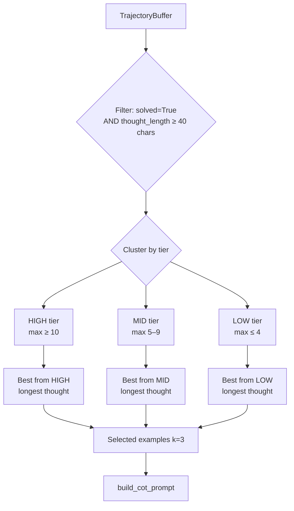

# Part 4: LLM + Chain-of-Thought Prompting

← [Part 3: Puzzle Data](03-puzzle-data.md) | Next: [Part 5: MCTS →](05-mcts.md)

---

## Why Chain-of-Thought?

A language model asked to directly answer `"Numbers: 3 8 8 3 → expression?"` rarely gets it right. Chain-of-thought prompting changes this by asking the model to **reason step by step** before committing to an answer.

The intuition: humans don't solve [3,3,8,8] by pattern-matching the answer directly — they try combinations, discard dead ends, and refine. CoT gives the model the same scratch pad.

```
Without CoT:
  User:  "Numbers: 3 8 8 3"
  Model: "3+8+8+3=22"   ← wrong, no reasoning, no chance to self-correct

With CoT:
  User:  "Numbers: 3 8 8 3"
  Model: "<thought>
            3+8+8+3=22 ✗
            3*8=24 but uses only 2 numbers ✗
            Try nested fraction: 8/(3-8/3)
            8/3 ≈ 2.667, 3-2.667=0.333, 8/0.333 = 24 ✓
          </thought>
          <answer>8/(3-8/3)</answer>"
```

---

## The Model: Qwen-7B-Chat

**File:** [`src/llm/generator.py`](../../src/llm/generator.py)

We use Qwen-7B-Chat with 4-bit quantization (loads in ~5GB of VRAM). The choice over LLaMA-3 is documented in [ADR 001](../adr/001-use-qwen-7b-over-llama3.md):

| Factor | Qwen-7B | LLaMA-3-8B |
|--------|---------|------------|
| Structured output compliance | Better (fewer format violations) | More creative, less constrained |
| 4-bit memory footprint | ~5 GB | ~6 GB |
| Math reasoning benchmarks | Comparable | Comparable |

```python
class LLMGenerator:
    def __init__(self, model_name: str = "Qwen/Qwen1.5-7B-Chat", device: str = "cuda"):
        self.tokenizer = AutoTokenizer.from_pretrained(model_name)
        self.model = AutoModelForCausalLM.from_pretrained(
            model_name,
            load_in_4bit=True,          # BitsAndBytes 4-bit quantization
            device_map="auto",
        )

    def generate(self, messages: list[dict], max_new_tokens: int = 512) -> str:
        prompt = self.tokenizer.apply_chat_template(messages, tokenize=False)
        inputs = self.tokenizer(prompt, return_tensors="pt").to(self.model.device)
        output = self.model.generate(**inputs, max_new_tokens=max_new_tokens)
        return self.tokenizer.decode(output[0][inputs["input_ids"].shape[1]:])
```

> **Note:** `LLMGenerator` is not imported in `src/llm/__init__.py` — an intentional decision to prevent `transformers` from loading at test collection time. Import it directly: `from src.llm.generator import LLMGenerator`.

---

## Prompt Construction

**File:** [`src/llm/prompts.py`](../../src/llm/prompts.py)

The prompt is a standard multi-turn chat format:

```
[system]:    You are a mathematical reasoning assistant...
[user]:      Numbers: 2 3 4 6
[assistant]: <thought>Try (2+3+4)×6 = 54 ✗ ... Try 3×(6+4−2) = 24 ✓</thought>
             <answer>3 * (6 + 4 - 2)</answer>
[user]:      Numbers: 1 5 5 5
[assistant]: <thought>...</thought><answer>5 * (5 - 1/5)</answer>
[user]:      Numbers: 3 8 8 3       ← new puzzle
```

The assistant reads the pattern from the few-shot turns and applies the same reasoning structure.

```python
def build_cot_prompt(numbers, few_shot_examples=None, use_seed_examples=True):
    messages = [{"role": "system", "content": _SYSTEM_PROMPT}]

    for ex in (few_shot_examples or []):
        messages.append({"role": "user",      "content": f"Numbers: {' '.join(str(n) for n in ex['numbers'])}"})
        messages.append({"role": "assistant", "content": str(ex["solution"])})

    messages.append({"role": "user", "content": f"Numbers: {' '.join(str(n) for n in numbers)}"})
    return messages
```

---

## Few-Shot Example Selection

**File:** [`src/llm/few_shot.py`](../../src/llm/few_shot.py)

Few-shot examples have a massive effect on solve rate. Bad examples (all easy, all same pattern) teach the model one solution structure. Good examples teach it how to reason about novel configurations.

### Selection Algorithm



### Why tier diversity matters

Without tier-based sampling:
- The buffer fills with easy puzzles (model solves those most often)
- Few-shot examples become all easy
- Model gets no signal for hard puzzles
- Performance on high-tier puzzles stagnates

With tier-based sampling:
- At least one example per difficulty level
- Model sees different reasoning patterns
- Hard-puzzle performance improves across iterations

### The `_thought_length` heuristic

```python
def _thought_length(response: str) -> int:
    match = _THOUGHT_RE.search(response)       # <thought>...</thought>
    return len(match.group(1).strip()) if match else 0
```

A longer thought trace generally means:
- More explicit step-by-step reasoning
- More exploration of alternatives before committing
- Better as a teaching example for the next iteration

This is a proxy, not a perfect metric. But it correlates well with example quality in practice.

---

## Seed Examples

Before any training trajectories exist, the system falls back to three hand-curated examples that cover the full difficulty spectrum:

### Example 1: Low-tier [2, 3, 4, 6]

```
<thought>
Try (2 + 3 + 4) × 6 = 54. Not 24.
Try 3 × (6 + 4 − 2) = 3 × 8 = 24. Yes!
</thought>
<answer>3 * (6 + 4 - 2)</answer>
```

**Pattern demonstrated:** Subtraction to reduce to 8, then multiply by 3.

### Example 2: Mid-tier [1, 5, 5, 5]

```
<thought>
Try 5 × 5 − 1 × 5 = 20. No.
Use 1/5: 1/5 = 0.2. 5 − 0.2 = 4.8. 4.8 × 5 = 24!
Expression: 5 × (5 − 1/5)
</thought>
<answer>5 * (5 - 1/5)</answer>
```

**Pattern demonstrated:** Using one number as a divisor to create a non-integer intermediate.

### Example 3: High-tier [3, 3, 8, 8]

```
<thought>
Standard operations: 3+3+8+8=22, 3×8=24 but uses only two numbers.
Try nested fractions: 8 / (3 − 8/3).
8/3 ≈ 2.667. 3 − 2.667 = 0.333. 8 / 0.333 = 24. Yes!
</thought>
<answer>8 / (3 - 8/3)</answer>
```

**Pattern demonstrated:** Nested fraction to create a small denominator, then divide to reach 24.

---

## What the Model Response Looks Like

After sending the full prompt, the model produces:

```
<thought>
Let me try combinations for [5, 6, 7, 8]:
5 + 6 + 7 + 8 = 26 ✗
8 × (7 - 6 + 5) = 48 ✗ (too big)
(8 - 5) × (6 + 7) — wait, 3 × 13 = 39 ✗
Try: 6 × (8 - 7 + 5) = 6 × 6 = 36 ✗
Try: (6 + 7 - 5) × 8 — 8 × 8 = 64 ✗
Try: 7 × (8 - 5) + 6 — no, 7×3+6 = 27 ✗
Try: (5 - 7/8) × ... hmm
Try: 8 / (7 - 5) + 6×(?) — need simpler approach
(8 × 6) / (7 - 5) = 48 / 2 = 24 ✓
</thought>
<answer>(8 * 6) / (7 - 5)</answer>
```

The verifier then extracts `(8 * 6) / (7 - 5)`, checks `[5,6,7,8]` vs `[5,6,7,8]`, evaluates `48/2 = 24.0`, and returns `reward = 1.0`.

---

## Zero-Shot Ablation

For research comparison, you can disable few-shot examples:

```python
prompt = build_cot_prompt(numbers, use_seed_examples=False)
```

The model still gets the system prompt (which explains the format) but no demonstrations. Typical solve rate drops from ~30% to ~15% without few-shot examples, which confirms the examples are load-bearing.

---

## Running Without a GPU

The LLM requires CUDA. But you can test the prompt construction without any model:

```python
from src.llm.prompts import build_cot_prompt

messages = build_cot_prompt([3, 8, 8, 3])
for msg in messages:
    print(f"[{msg['role']}]  {msg['content'][:80]}...")
```

Output:

```
[system]  You are a mathematical reasoning assistant. Your task is to solve the ...
[user]    Numbers: 2 3 4 6
[assistant] <thought>
Try (2 + 3 + 4) × 6 = 54. Not 24. ...
[user]    Numbers: 1 5 5 5
[assistant] <thought>
Try 5 × 5 − 1 × 5 = 20. No. ...
[user]    Numbers: 3 8 8 3
```

---

## Summary

```
Puzzle [3, 8, 8, 3]
       │
       ▼
build_cot_prompt()
  ├── System: rules + format
  ├── Few-shot: 3 examples (low / mid / high tier)
  └── User: "Numbers: 3 8 8 3"
       │
       ▼
LLMGenerator.generate()   (requires GPU)
       │
       ▼
"<thought>...</thought><answer>8/(3-8/3)</answer>"
       │
       ▼
extract_expression() → "8/(3-8/3)"
       │
       ▼
verify_solution()  → reward=1.0, solved=True
```

---

Next: [Part 5 — Monte Carlo Tree Search →](05-mcts.md)
