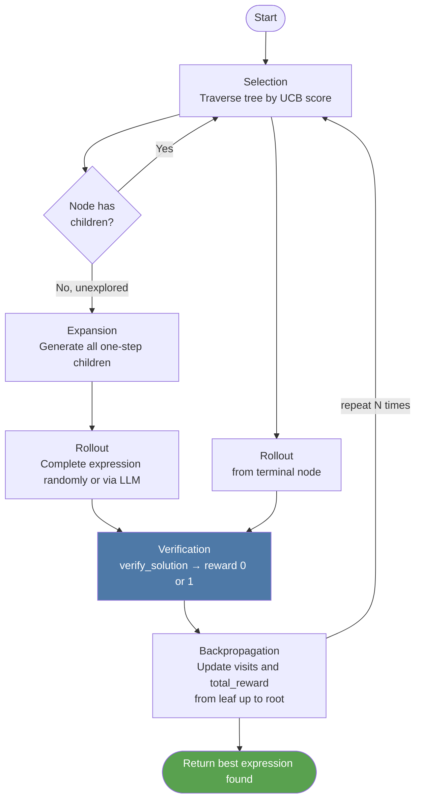

# Part 5: Monte Carlo Tree Search

← [Part 4: LLM + CoT](04-llm-and-cot.md) | Next: [Part 6: RL Training →](06-rl-training.md)

---

## Why We Need Search

The LLM is a strong reasoner but it has limited "working memory." For hard puzzles like [3,3,8,8], the solution `8/(3−8/3)` requires recognizing that you should divide 8 by 3 *first*, create the denominator `3−8/3`, and then divide again. That chain of reasoning is difficult to produce in a single forward pass.

Monte Carlo Tree Search **systematically explores** the space of partial expressions. Instead of committing to a complete expression upfront, MCTS builds it one operation at a time, backtracking when a path looks unpromising.

**Result on this codebase:** MCTS with *random* rollout (no LLM, no GPU) achieves **58% solve rate** — vs 3% for pure random guessing.

---

## The State Representation

The key insight is choosing the right state. We represent the current state as a **list of `ExprPair` objects** — the numbers still available to combine:

```python
@dataclass
class ExprPair:
    value: Fraction   # exact rational value
    expr:  str        # expression string for this value
```

**Initial state** for puzzle [3, 8, 8, 3]:

```
[ExprPair(3, "3"),
 ExprPair(8, "8"),
 ExprPair(8, "8"),
 ExprPair(3, "3")]
```

**After action** `8 ÷ 3 = 8/3`:

```
[ExprPair(3, "3"),
 ExprPair(8, "8"),
 ExprPair(8/3, "(8 / 3)")]
```

**After action** `3 − 8/3 = 1/3`:

```
[ExprPair(8, "8"),
 ExprPair(1/3, "(3 - (8 / 3))")]
```

**After action** `8 ÷ 1/3 = 24`:

```
[ExprPair(24, "(8 / (3 - (8 / 3)))")]   ← terminal, verify!
```

Using `Fraction` for values ensures exact arithmetic — no floating-point rounding when checking if the result equals 24.

---

## The MCTS Loop



Each iteration consists of four phases:

### Phase 1: Selection

Starting from the root, descend by always picking the child with the highest **UCB score**:

```python
@property
def ucb_score(self) -> float:
    if self.visits == 0:
        return float("inf")           # unvisited nodes have priority
    exploitation = self.total_reward / self.visits
    exploration  = math.sqrt(2 * math.log(self.parent.visits) / self.visits)
    return exploitation + exploration
```

**UCB formula explained:**

```
UCB = (total_reward / visits) + √(2 × ln(parent_visits) / visits)
       ─────────────────────    ─────────────────────────────────
            exploitation                  exploration
      (prefer high-reward paths)   (prefer less-visited paths)
```

The `√2` constant balances the two terms — a well-studied default from the UCT algorithm. Paths with few visits have high exploration bonus. Paths with high cumulative reward have high exploitation bonus. Over many iterations, the tree finds the right balance.

### Phase 2: Expansion

When we reach an unvisited node (visits == 0 after the first rollout), expand it:

```python
def expand(self) -> list[MCTSNode]:
    children = []
    for i in range(len(self.pairs)):
        for j in range(len(self.pairs)):
            if i == j: continue
            for op in ["+", "-", "*", "/"]:
                result = _apply_op(self.pairs[i], self.pairs[j], op)
                if result is None: continue   # skip division by zero
                new_pairs = [p for k, p in enumerate(self.pairs)
                             if k not in (i, j)] + [result]
                children.append(MCTSNode(pairs=new_pairs, parent=self))
    self.children = children
    return children
```

For a 4-number state, this generates up to `4 × 3 × 4 = 48` children (minus invalid divisions). For a 3-number state: `3 × 2 × 4 = 24` children.

**Example expansion for [3, 8, 8, 3]:**

```
Some of the 48 child nodes:
  (3+8)=11  → [11, 8, 3]
  (3-8)=-5  → [-5, 8, 3]
  (3*8)=24  → [24, 8, 3]  ← promising!
  (3/8)=0.375 → [0.375, 8, 3]
  (8+3)=11  → [11, 8, 3]  (same as first)
  (8-3)=5   → [5, 8, 3]
  (8*3)=24  → [24, 8, 3]  ← same as above
  (8/3)≈2.67 → [2.67, 8, 3]  ← key intermediate!
  ... etc
```

### Phase 3: Rollout

From the selected/expanded node, complete the expression to a terminal state. The simplest policy is random:

```python
def _random_rollout(pairs: list[ExprPair]) -> str:
    remaining = list(pairs)
    while len(remaining) > 1:
        i, j = random.sample(range(len(remaining)), 2)
        op = random.choice(["+", "-", "*", "/"])
        result = _apply_op(remaining[i], remaining[j], op)
        if result is None:
            op = random.choice(["+", "-", "*"])  # retry without /
            result = _apply_op(remaining[i], remaining[j], op)
        remaining = [p for k, p in enumerate(remaining) if k not in (i, j)]
        remaining.append(result)
    return remaining[0].expr
```

The **LLM rollout policy** (covered next) replaces this with a reasoned completion — the main way LLM capability improves MCTS performance.

### Phase 4: Backpropagation

After getting a reward (0 or 1) from the verifier, update all nodes on the path from leaf to root:

```python
current = node
while current is not None:
    current.visits += 1
    current.total_reward += reward
    current = current.parent
```

Over many iterations, high-reward paths accumulate more total_reward, increasing their UCB exploitation term, which makes them more likely to be selected again.

---

## Tree Structure: A Concrete Example

Let's trace 5 iterations on puzzle [2, 2, 4, 6]:

**Iteration 1:**

```
Root [2,2,4,6]
 └── (visits=0, UCB=∞, selected)
      → Expand to 48 children
      → Random child: 2+2=4 → [4, 4, 6]
      → Rollout: 4×4+6=22 ✗  reward=0
      → Backprop: root.visits=1, root.total_reward=0
```

**Iteration 2:**

```
Root [2,2,4,6] (visits=1, reward=0)
 ├── [4,4,6] (visits=1, reward=0)  UCB = 0 + √(2×ln1/1) = 0
 ├── [2,4,6] (2-2=0) (visits=0)   UCB = ∞  ← selected
 └── ... 46 more unvisited children with UCB=∞
```

**After many iterations, the best paths emerge:**

```
Root [2,2,4,6]  (visits=500)
 ├── [24,2,2] via 4×6=24 (high UCB — eventually found 24×(2/2)=24)
 │    └── [24,1] via 2/2=1
 │         └── [24] terminal → reward=1.0  ✓
 ├── [6,4,4] via 2+2=4 (medium UCB)
 └── [-2,4,6] via 2-4=-2 (low UCB — never leads to 24)
```

---

## LLM as Rollout Policy

**File:** [`src/reasoning/llm_rollout.py`](../../src/reasoning/llm_rollout.py)

```python
def make_llm_rollout_policy(generator: LLMGenerator) -> RolloutPolicy:
    def policy(pairs: list[ExprPair]) -> str:
        # Show the LLM what numbers are currently available
        available = ", ".join(f"{p.expr}={float(p.value):.4f}" for p in pairs)
        messages = [{
            "role": "system",
            "content": "Complete the Game of 24 using these intermediate values..."
        }, {
            "role": "user",
            "content": f"Available values: {available}\nWrite an expression using each once that equals 24."
        }]
        response = generator.generate(messages)
        expr = extract_expression(response)
        return _substitute_values(expr, pairs) if expr else pairs[0].expr
    return policy
```

The `_substitute_values()` function maps any numeric literal in the expression back to the originating `ExprPair.expr`. So if the LLM says `"4.8 × 5"` and `4.8` came from `"(5 - 1/5)"`, the function substitutes back to produce `"(5 - 1/5) × 5"`.

**Effect on solve rate:** Replacing random rollout with an LLM rollout policy is the Sprint 4 objective. Even a pre-trained (untuned) LLM improves over random significantly for mid/high-tier puzzles.

---

## Tree of Thoughts: An Alternative

**File:** [`src/reasoning/tree_of_thoughts.py`](../../src/reasoning/tree_of_thoughts.py)

ToT takes a different approach: instead of expression-tree states, it uses beam search over LLM-proposed reasoning steps:

```
Beam width = 3 (keep top-3 partial solutions at each depth)
Max depth  = 4 steps

Step 1 proposals (LLM generates k=5, beam keeps 3):
  "3 × 8 = 24 [but uses only 2 numbers]" → heuristic = 0 (not useful)
  "8 ÷ 3 = 2.667"                        → heuristic = 1/(1+|2.667-24|) = 0.046
  "3 + 8 = 11"                           → heuristic = 1/(1+|11-24|) = 0.071
  "8 × 3 = 24"                           → heuristic = 1/(1+0) = 1.0  ← best!
  "8 - 3 = 5"                            → heuristic = 1/(1+|5-24|) = 0.05
```

The heuristic `1/(1+|value-24|)` measures how close the partial result is to 24 — higher is better.

ToT and MCTS are complementary: MCTS is better for systematic exploration, ToT is better when the LLM's reasoning steps are already high-quality. The benchmark comparing them is deferred until after LLM fine-tuning (Sprint 4).

---

## Running MCTS Without a GPU

```bash
python scripts/compare_strategies.py --n-puzzles 200 --mcts-iterations 500
```

Output:

```
Strategy                    Solve Rate   Time
──────────────────────────  ──────────   ────
Random (10 attempts)             3.0%   0.1s
MCTS random rollout (500)       58.0%   45s
Brute force (ceiling)           77.0%   2s

MCTS reaches 75.3% of brute-force ceiling.
```

The 200-puzzle benchmark takes ~45 seconds on a MacBook Pro (pure Python, no GPU). This is the benchmark that produces the numbers in the README.

---

## Convergence Behavior

MCTS with random rollout exhibits diminishing returns:

```
Iterations   Solve Rate   Notes
─────────    ──────────   ──────────────────────────────────
100          42%          Not enough exploration
500          58%          Good coverage, benchmark point
800          61%          Diminishing returns begin
2000         63%          Saturated — random policy can't go higher
```

The ceiling for random rollout is around 63%: puzzles that require specific non-obvious paths (like [3,3,8,8]) can't be reliably discovered by chance even with thousands of iterations. That's why the LLM policy matters — it provides informed guidance.

---

## Summary

```
mcts_search([3, 8, 8, 3], n_iterations=500)
     │
     ▼
Root: [ExprPair(3,"3"), ExprPair(8,"8"),
       ExprPair(8,"8"), ExprPair(3,"3")]
     │
     ▼  500 iterations of:
     │    Select (UCB)
     │    Expand (all one-step actions)
     │    Rollout (random or LLM)
     │    Backpropagate (update visits + reward)
     │
     ▼
Best expression found:
  "(8 / (3 - (8 / 3)))"  reward=1.0
     │
     ▼
Return ("(8 / (3 - (8 / 3)))", 1.0)
```

---

Next: [Part 6 — RL Training with GRPO →](06-rl-training.md)
