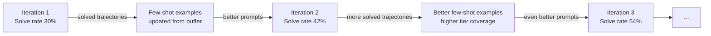

# Part 6: Reinforcement Learning with GRPO

← [Part 5: MCTS](05-mcts.md) | Next: [Part 7: Running It →](07-running.md)

---

## The Problem GRPO Solves

After Sprint 3, we have:
- A model that solves ~30% of puzzles zero-shot (CoT + few-shot)
- MCTS that finds solutions the model missed
- A verifier that gives binary 0/1 reward

But how do we make the model *better*? The answer is reinforcement learning: let the model generate many attempts, verify them, and update the model to produce more of the successful ones.

The challenge: standard RL algorithms like PPO require a **critic network** — a separate neural network that estimates the value of each state. Training a 7B-parameter critic is expensive and unstable.

**GRPO (Group Relative Policy Optimization)** removes the critic entirely.

---

## GRPO Explained

Instead of estimating absolute values, GRPO computes **relative advantages within a group**. For each puzzle, generate `G` responses (a group). The advantage of each response is its reward relative to the group mean:

```
Group for puzzle [3, 8, 8, 3]:
  Response 1: "8/(3-8/3)"     reward = 1.00
  Response 2: "<answer>24</answer>"  reward = 0.15  (format only, no numbers)
  Response 3: "3+8+8+3"       reward = 0.40
  Response 4: "8*3-8+3"       reward = 0.40
  Response 5: "3*8=24"        reward = 0.15
  ...
  Group mean = 0.42
  Group std  = 0.31

Advantages:
  Response 1: (1.00 - 0.42) / 0.31 = +1.87  ← push UP
  Response 2: (0.15 - 0.42) / 0.31 = -0.87  ← push DOWN
  Response 3: (0.40 - 0.42) / 0.31 = -0.06  ← near-neutral
```

The model is updated to increase probability of high-advantage responses and decrease probability of low-advantage ones.

### Why No Critic?

```
PPO (standard):                     GRPO (this system):
                                    
  State → Critic → V(s)              No critic needed!
  Advantage = r - V(s)               Advantage = (r - mean(group)) / std(group)
  
  Requires:                          Requires:
  - Second 7B network                - Just more rollouts per puzzle
  - Unstable V(s) estimates          - Stable by construction
  - Double memory                    - Same memory as inference
```

For binary-reward tasks like Game of 24, GRPO is both more memory-efficient and more stable than PPO. Full rationale in [ADR 002](../adr/002-implement-grpo-instead-of-ppo.md).

---

## The Dead Gradient Problem

GRPO has one critical failure mode: **if all rewards in a group are identical, the advantage is zero for every response, and gradient is zero**.

**Without shaped rewards:**

Early training — the model can't solve any puzzles. All rewards = 0.

```
Group mean = 0.0
Group std  = 0.0  ← undefined!
All advantages = 0.0 / 0.0 = NaN
Gradient = 0  → no learning happens
```

**With shaped rewards:**

Even wrong responses produce non-zero rewards (for format and number usage):

```
Response with good format but wrong answer: reward = 0.15 + 0.25 = 0.40
Response with wrong format and wrong answer: reward = 0.00

Group mean = 0.20, std = 0.18
Advantage of good-format response = (0.40 - 0.20) / 0.18 = +1.11
→ Model learns: "having the right format helps"
→ Gradient is non-zero → learning continues
```

Full rationale in [ADR 003](../adr/003-shaped-rewards-for-grpo.md).

---

## Shaped Reward Components

```
┌──────────────────────────────────────────────────────────────────┐
│                                                                  │
│   SHAPED REWARD BREAKDOWN                                        │
│                                                                  │
│   ┌─────────────────────────────────────────────────────────┐   │
│   │  Component     Check                        Value       │   │
│   │  ─────────     ─────                        ─────       │   │
│   │  Format        <thought> AND <answer> tags  +0.15       │   │
│   │  Numbers       used all 4 correct numbers   +0.25       │   │
│   │  Solve         expression = 24              +1.00       │   │
│   │  ─────────     ─────                        ─────       │   │
│   │  Total         (capped at 1.0)               1.00       │   │
│   └─────────────────────────────────────────────────────────┘   │
│                                                                  │
│   Effective trajectory types:                                    │
│                                                                  │
│   reward = 0.00  │████░░░░░░│  No tags, wrong numbers          │
│   reward = 0.15  │████████░░│  Format only                      │
│   reward = 0.40  │██████████│  Format + numbers, wrong result  │
│   reward = 1.00  │██████████│  Fully solved                     │
│                                                                  │
└──────────────────────────────────────────────────────────────────┘
```

Notice that format + solve = 1.15 is capped to 1.00. This prevents the model from gaming a high score by being well-formatted but wrong — it must actually solve the puzzle to break past 0.40.

---

## The Training Loop

**File:** [`scripts/train_rl.py`](../../scripts/train_rl.py)

```
For each iteration:
  ┌─────────────────────────────────────────────────────┐
  │                                                     │
  │  1. Sample batch of puzzles                         │
  │     (mix of solvable + unsolvable)                  │
  │                                                     │
  │  2. Generate rollouts                               │
  │     LLM generates G responses per puzzle            │
  │                                                     │
  │  3. Compute shaped rewards                          │
  │     compute_reward(response, puzzle)                │
  │                                                     │
  │  4. Run MCTS fallback                               │
  │     For failed puzzles, run MCTS and store          │
  │     successful trajectories                         │
  │                                                     │
  │  5. Update trajectory buffer                        │
  │     Add all (puzzle, prompt, response, reward)      │
  │                                                     │
  │  6. Train with GRPO                                 │
  │     Filter reward > 0, compute advantages,          │
  │     compute policy gradient, update weights         │
  │                                                     │
  │  7. Update few-shot examples                        │
  │     select_few_shot_examples() picks the best       │
  │     from buffer for the next iteration              │
  │                                                     │
  │  8. Save checkpoint                                 │
  │     checkpoints/grpo/iter_{i:03d}/                  │
  │                                                     │
  └─────────────────────────────────────────────────────┘
```

---

## The GRPO Trainer

**File:** [`src/rl/trainer.py`](../../src/rl/trainer.py)

```python
class GRPOTrainer:
    def train_step(self, trajectories: list[Trajectory]) -> float:
        # Only train on trajectories with reward > threshold
        selected = self._select_trajectories(buffer)
        dataset  = self._to_hf_dataset(selected)

        # GRPO advantage computation
        rewards   = [t.reward for t in selected]
        mean_r    = sum(rewards) / len(rewards)
        std_r     = (sum((r - mean_r)**2 for r in rewards) / len(rewards)) ** 0.5
        std_r     = max(std_r, 1e-8)  # avoid division by zero
        advantages = [(r - mean_r) / std_r for r in rewards]

        # TRL's GRPO implementation handles the rest
        return self.trl_trainer.train(dataset, advantages)
```

The `_select_trajectories` function filters and sorts:

```python
def _select_trajectories(self, buffer: TrajectoryBuffer) -> list[Trajectory]:
    candidates = [t for t in buffer.all()
                  if t.reward > self.config.min_reward_threshold]
    return sorted(candidates, key=lambda t: t.reward, reverse=True)
```

Training on all non-zero reward trajectories (not just fully solved ones) is critical in early iterations when the model rarely solves puzzles. The format-reward trajectories provide gradient signal that keeps training alive.

---

## Training Dynamics (Synthetic Projection)

The notebook `notebooks/02_rl_training_dynamics.ipynb` simulates what we expect to see. Here are the projected curves over 5 iterations:

```
Iteration    Solve Rate    Avg Reward    Partial Rate
─────────    ──────────    ──────────    ────────────
    1            30%          0.38           25%
    2            42%          0.48           22%
    3            54%          0.55           19%
    4            61%          0.60           16%
    5            65%          0.63           13%
              ─────────    ──────────
Baseline         58%          —           (MCTS random)
Ceiling          77%          —           (brute force)
```

Key observations:
1. **Partial rate decreases** — the model learns to use correct numbers and eventually solve
2. **Solve rate rises faster** than partial rate falls — format compliance is learned first
3. **Convergence slows** after iteration 3 — easy puzzles saturate, hard ones need more iterations

### GRPO Gradient Health Check

The notebook also computes within-group reward variance — the key health metric for GRPO:

```
Iteration    Group Variance    Status
─────────    ──────────────    ──────
    1              0.18        GOOD
    2              0.21        GOOD
    3              0.19        GOOD
    4              0.15        GOOD
    5              0.12        GOOD — slight drop as model converges
```

Variance > 0.05 is needed for non-trivial gradients. Shaped rewards ensure we never drop to zero.

---

## The Self-Improvement Loop

What makes this system "self-improving" is the feedback loop between better performance and better few-shot examples:



The few-shot examples improve because:
- Higher solve rate → more high-quality trajectories in buffer
- `select_few_shot_examples()` picks longest-thought solved trajectories per tier
- Better examples → model reasons better → higher solve rate next iteration

---

## Trajectory Buffer

**File:** [`src/rl/trajectory.py`](../../src/rl/trajectory.py)

Each trajectory stores everything needed to reproduce the training signal:

```python
@dataclass
class Trajectory:
    puzzle:     list[int]          # e.g. [3, 8, 8, 3]
    prompt:     list[dict]         # full messages list (few-shot + user)
    response:   str                # raw model output with <thought>/<answer>
    reward:     float              # shaped reward total
    solved:     bool               # True if expression = 24
    expression: Optional[str]      # extracted answer, or None
```

Saved to disk as JSONL (one trajectory per line) after each iteration:

```json
{"puzzle": [3,8,8,3], "reward": 1.0, "solved": true, "expression": "8/(3-8/3)", ...}
{"puzzle": [1,1,1,1], "reward": 0.0, "solved": false, "expression": null, ...}
```

The buffer persists between iterations. This means:
- You can resume training from a checkpoint
- Few-shot selection uses accumulated trajectories, not just the current iteration
- Post-hoc analysis can inspect every trajectory from every iteration

---

## Running RL Training (GPU Required)

```bash
python scripts/train_rl.py \
    --iterations 5 \
    --rollouts-per-iter 50 \
    --group-size 8 \
    --mcts-fallback \
    --save-dir checkpoints/grpo
```

After training, evaluate:

```bash
python scripts/evaluate.py \
    --model-path checkpoints/grpo/iter_004 \
    --n-puzzles 200
```

---

## Without a GPU: Analyze Synthetic Curves

The RL training notebook runs without any model. Open it to see projected training dynamics:

```bash
jupyter notebook notebooks/02_rl_training_dynamics.ipynb
```

Set `SYNTHETIC = True` (default). The notebook generates:
- Solve rate and shaped reward curves per iteration
- Stacked bar chart of zero / partial / solved trajectory composition
- GRPO gradient health (within-group variance) per iteration
- Convergence summary vs MCTS baseline and brute-force ceiling

When you complete a real GPU run, set `SYNTHETIC = False` and point `TRAJECTORY_DIR` at your checkpoint directory to see actual results.

---

## Summary

```
┌──────────────────────────────────────────────────────────────┐
│                    GRPO TRAINING LOOP                        │
│                                                              │
│  Puzzle batch                                                │
│       │                                                      │
│       ▼                                                      │
│  LLM generates G responses per puzzle                        │
│       │                                                      │
│       ▼                                                      │
│  compute_reward() → ShapedReward per response                │
│       │                                                      │
│       ▼                                                      │
│  MCTS fallback for failed puzzles (adds more solved)         │
│       │                                                      │
│       ▼                                                      │
│  TrajectoryBuffer.add() for each (puzzle, response, reward)  │
│       │                                                      │
│       ▼                                                      │
│  _select_trajectories() → filter reward > 0, sort           │
│       │                                                      │
│       ▼                                                      │
│  Compute GRPO advantages: A_i = (r_i − mean) / std          │
│       │                                                      │
│       ▼                                                      │
│  TRL GRPOTrainer.train() → update LLM weights               │
│       │                                                      │
│       ▼                                                      │
│  select_few_shot_examples() → update prompt for next iter   │
│       │                                                      │
│       ▼                                                      │
│  Save checkpoint                                             │
└──────────────────────────────────────────────────────────────┘
```

---

Next: [Part 7 — Running the Full System →](07-running.md)
